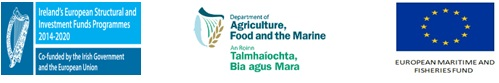

The **MyDas** project simulation tested a range of assessment models and methods in order to establish Maximum Sustainable Yield (MSY), or proxy MSY reference points across the spectrum of data-limited stocks.  

Models are implemented as [FLR](http://www.flr-project.org/) packages and there are a variety of [vignettes](https://github.com/flr/mydas/wiki/mydas_vignettes) with examples, and datasets can be downloaded from [google drive](https://drive.google.com/open?id=1WfthxhdBgZfPg_lrUkpKzwRQHe61RBgK)

**MyDas** was funded by the Irish exchequer and [EMFF 2014-2020](https://ec.europa.eu/fisheries/cfp/emff_en) 

**Contact:** [Laurence Kell](<laurie@kell.es>) and [Coilin Minto](<coilin.minto@gmit.ie>) 

------------------------------

[**1:** Study Stocks](https://github.com/flr/mydas/wiki/1-Stock-prioritisation)

A number of example stocks were identified, the final list of stocks will be prioritised using criteria like: economic value of the stock; importance of the species to the ecosystem (key-stone species); sensitivity to the impacts of fishing; available data.

[**2:** Datasets](https://github.com/flr/mydas/wiki/2-Data-collation)

The project relies on existing data sets, however these data need to be collated in a usable form. Most datasets are available from the Marine Institute, or are publicly available, but others may only exist in other European labs/agencies.

[**3:** Data Poor Methods](https://github.com/flr/mydas/wiki/3-Method-and-simulation-framework-development-and-implementation)

A number of data-limited methods exist. In order to compare the performance of these methods it would be useful to implement them all in the same framework, e.g. R. New methods may also be developed in the same framework.

[**4:** Method Evaluation](https://github.com/flr/mydas/wiki/4-Method-performance-appraisal)
Develop set of diagnostics that can be applied across range of models. Also assess the stability of the model, sensitivity to assumptions and bias in the advised catch.

[**5:** Reference point comparisons](https://github.com/flr/mydas/wiki/5-Reference-point-comparisons-(across-candidate-methods))
Once reference points have been identified, their performance should be evaluated through simple management strategy evaluations.

[**6:** Collaboration](https://github.com/flr/mydas/wiki/6-Liaison-with-Marine-Institute)

The main [outputs](https://github.com/flr/mydas/wiki/Outputs) are 

+ Methods implemented as part of the FLR suite of R packages
+ Peer review papers on
     - Generic methods and
     - Applications

and the expected [outcomes](https://github.com/flr/mydas/wiki/Outputs)  are
+ Management plans developed with ICES and others  

The service provider is expected to meet on a regular basis with MI staff involved in the project:
Monthly update meetings at the Marine Institute premises in Oranmore Galway with researcher providing the research services, 
6-monthly progress reports and meetings at the Marine Institute with the researcher providing the research services and contract manager. 

[Other projects](https://github.com/flr/mydas/wiki/7-Linkage-with-other-projects)
The service provider is required to link research output to the following projects: 

+ **The International Council of the Exploration of the Sea (ICES)** is in the process of developing methods to identify MSY proxy reference points for data-limited stocks ([WKLIFE](http://ices.dk/sites/pub/Publication%20Reports/Expert%20Group%20Report/Fisheries%20Resources%20Steering%20Group/2019/WKLIFEIX/WKLIFE_IX_2019.pdf)). The service provider is required to contribute to this process by proposing and testing new assessment models and methods of establishing reference points and will be expected to attend up to 4 one-week meetings at ICES headquarters in Copenhagen. However there are key differences with the ICES approach. Since this research contract will include stocks not currently assessed by ICES; focusing on the available data for each stock first and on the methods second; the ICES approach focuses on the methods first and then applies a limited number of methods to a large number of stocks.

+ **Marine Institute** research and development on data poor stocks which includes the biology, stock dynamics and Management Strategy Evaluation (MSE) for Pollock.  It is expected that the service provider will collaborate closely with the team developing assessment methods for the pollock stock.

+ **Galway Mayo Institute of Technology GMIT** had been awarded a Cullen fellowship for a PhD project on management strategy evaluation for monkfish. It is expected that the Cullen PhD and service provider will closely collaborate on tasks like data collation, assessment model implementation, simulation model development and management strategy evaluation. 

